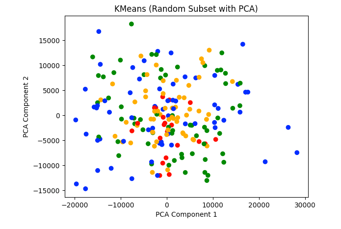
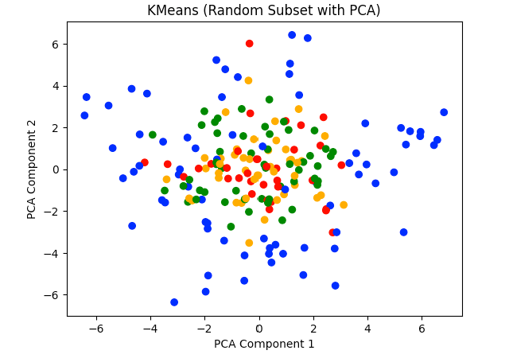

---
---

# CS 7641: Project Midterm
## Introduction
ML in agriculture uses image analysis to detect diseases early, boosting crop health and yields. It works by training models on data (images of healthy & diseased plants) to identify disease patterns. Existing literature includes Ramcharan et al. which explores the use of deep learning for detecting disease in Cassava (major staple in Africa) [1]. They used transfer learning to construct a deep CNN to identify a few different diseases on this crop to somewhat accurate results. In a paper by Ferentinos, they use CNNs to identify diseases on the leaves of plants [2]. In a paper by Mohanty et al. they looked at 26 diseases across 14 plant species and achieved a model in training with an accuracy of 99.35% [3]. Our dataset (Five Crop Diseases Dataset) contains images of five different crops, with each crop containing healthy and diseased images. For example, diseases for corn include common rust, gray leaf spot, and northern leaf blight. Overall, there are 17 classes (crop x disease combination) and over 13,000 images.

## Problem Statement
We're focusing on the challenge of quickly and accurately identifying diseases in crops like corn using machine learning. This issue is critical because crop diseases can lead to major losses in yield and quality, significantly impacting the economy. Our goal is to create a tool to help farmers easily detect these diseases, leading to better decision-making, healthier crops, and increased productivity.

The motivation behind our project is clear: current disease detection methods in agriculture are often slow and require expert knowledge, which might not be readily available to all farmers. By using our machine learning model, we can offer a more efficient and accessible solution. Our extensive dataset, which includes thousands of images of both healthy and diseased plants, serves as the foundation for developing a model that aims for high accuracy in disease identification.

The goal of our project is to transform agricultural practices. With our machine learning tool, farmers can quickly identify and address crop diseases, saving time and reducing economic losses. This not only benefits individual farmers but also contributes to the broader goal of ensuring food security and sustainability in the agricultural sector.

## Methods

For this midterm, we implemented a kmeans model using HOG descriptors and raw image data. This allowed the data to capture a broad spectrum of features that work to improve the accuracy of the clustering based on health conditions. We used HOG descriptors because they capture the texture and edge information, which is effective in outlining distinctive patterns on the image, such as patterns with disease in corn leaves. This, combined with the raw image data which captures the full range of visual information, including color and variatinos across the image, work to create several features that may be indicitive of disease. After taking this image data, PCA is applied to reduce the dimensionality of the feature space from potentially thousands of dimensions to only a few hundred. We do this to improve model training efficiency and only retain the most imformative features of the datase. 

We then used K-means clustering to group the corn images into four predefined clusters, each of which corresponded to a specific condition affecting corn health. We decided to use Kmeans because it offers a way to separate the dataset into multiple distinct groups based on feature similarity, and it can be computationally effecient after a PCA reduction. This algorithm works well on large datasets, and the results are easy to validate. Furthermore, because this model is unsupervised, it can divide image sets into clustesr based on vector similarity instead of labels, which can be very useful for classification even after assigning labels to the clusters. Essentially, this model divides the image sets into clusters based on vector similarity, which is useful for finding unique patterns that could lead to disease.

## Results and Discussion

To measure the efficacy of the clustering, we using a Calinski-Harabaz index, which measures separation between clusters, and a silhouette coefficient, which measures the similarity within clusters compared to between clusters.
We also used a custom beta_cv function, which measures the ratio of the average between intra-cluster pairwise distances to the average nearest cluster, and a confusion matrix to evaluate the performance of the classification.
We also created a visualization, reduced to two features with PCA to present how the model clustered and separated these features.
The values are as follows:

**For the images:**

Silhouette Coefficient: 0.07437938050979319

Calinski-Harabasz Index: 349.41544056745397

Beta-CV value: 366.9067013578043

Confusion Matrix:

[[258 417 238 249]

[378 362 207 245]

[207 99 29 178]

[383 200 78 324]]

Accuracy: 0.2525960539979232

**For the HOGS:**

Silhouette Coefficient: 0.08140483623935373

Calinski-Harabasz Index: 338.03792500609984

Confusion Matrix:

[[353 185 337 287]

[603 239 229 121]

[261 110 93 49]

[458 208 215 104]]

Accuracy: 0.20482866043613707

Based on pretty much every metric used to evaluate the clustering we've done, this is a very bad clustering. The accuracy is around ~0.25, which is about the same as guessing randomly, given that there were only four clusters. The silhouette coefficient is near 0 for the clustering, which indicates that there are many overlapping clusters. The Beta CV score indicates that the average intra-cluster distance is much greater than the distance to the nearest cluster center (over 300x), which gives more evidence that the clusters are not spread out and are generally overlapping. The confusion further demonstrates this, as shown by the off diagonal entries. This represents misclassifications in the data. Finally, the visualizations show scatter plots visually showing the clustering of the k-means on our dataset, after being reduced to two features for vvisualization purposes. Each point represents an individual data instance, and the colors demonstrate different clusters. There are no clear boundaries between the clusters and it appears almost random, further showing the poor clustering.

Our next steps would be, given the poor clustering results, to review the steps we have taken to build the model. We would need to review the data we used, as well as the preprocessing steps to ensure that the data is standardized properly. We would also need to consider outlier detection as these could mess up clustering. We may also want to evaluate the features we used for clustering, and perhaps increase the dimensionality of PCA to increase variance. Additionally, we could experiment with different clustering algorithms and parameters. Overall, this model needs further improvement and testing to increase its performance.

## Gantt Chart
[(link to gantt chart)](https://gtvault-my.sharepoint.com/:x:/g/personal/jpurkar3_gatech_edu/EZ0NvVTVG0xOvP2TG49LMQ0Blx8_oc7quM3DplCroAo2sw)

## Contribution Table
| Member        | Task                                                  |
| ------------- | ----------------------------------------------------- |
| Brandon       | Github page update and repo descriptions              |
| Ojasw         | Model coding and training                             |
| Janhavi       | Problem Statement, background, Gantt Chart            |
| Samarth       | Data preprocessing                                    |
| Aditya        | Quantitative metrics,results evaluation and analysis  |

## References
[1] Ramcharan, A., Baranowski, K., McCloskey, P., Ahmed, B., Legg, J., & Hughes, D. P. (2017). Deep Learning for Image-Based Cassava Disease Detection. Frontiers in plant science, 8, 1852. https://doi.org/10.3389/fpls.2017.01852

[2] Ferentinos, K. P. (2018). Deep learning models for plant disease detection and diagnosis. Computers and Electronics in Agriculture, 145, 311-318. https://doi.org/10.1016/j.compag.2018.01.009

[3] Mohanty, S. P., Hughes, D. P., & Salathé, M. (2016). Using Deep Learning for Image-Based Plant Disease Detection. Frontiers in plant science, 7, 1419. https://doi.org/10.3389/fpls.2016.01419
